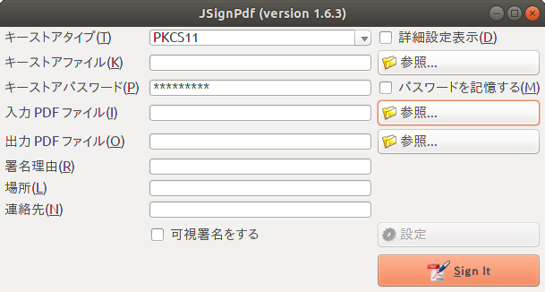
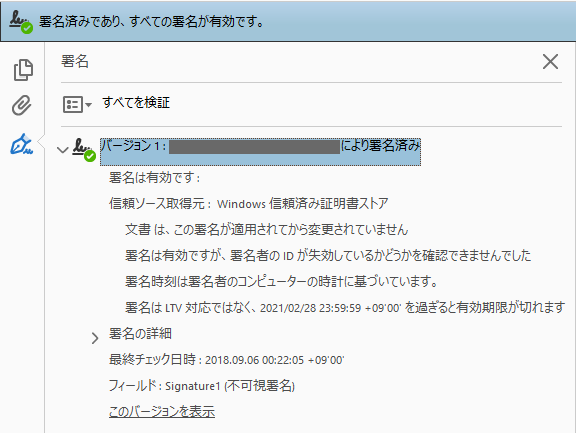
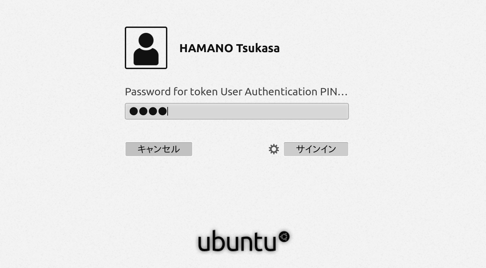
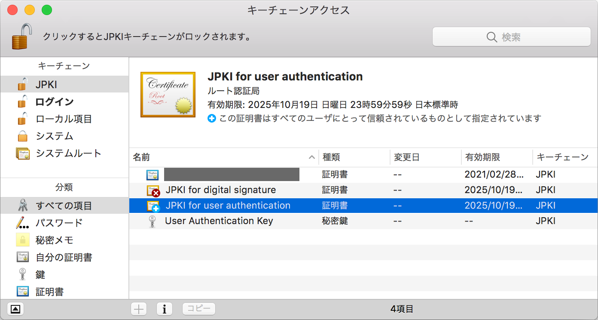
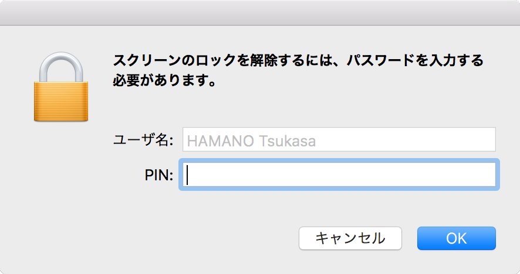

\let\cleardoublepageorig\cleardoublepage
\renewcommand{\cleardoublepage}{\clearpage}

\frontmatter
\let\thesectionorig\thesection
\renewcommand{\thesection}{}

# はじめに

マイナンバーカードというとどんな印象があるでしょうか?

「使いみちが無い」
「なんとなく怖い」

一般的にその様な印象を持っている方が多いようです。
マイナンバー（個人番号）に関して様々な議論がありますが、この本は個人番号制度とは直接関係ありませんし触れないようにしています。

これは自分のマイナンバーカードに搭載されているICチップにアクセスして遊ぼう、という趣旨の本です。
具体的にはOpenSCというオープンソース・ソフトウェアを使いながら公的個人認証の仕組みとその将来性について解説します。

公的個人認証は私達のオンライン生活をより安全・便利にする可能性を持っています。
しかし、このサービスが広く活用されるにはまだ多くの課題があります。

まず国民全体に対する認知度が足りていません。
とりわけ、この本の対象読者である技術者にさえよく知られていないシステムが、安心して利用できる社会基盤として世の中に普及することは難しいでしょう。

1章はマイナンバーカードと公的個人認証の技術的な背景を説明します。
総務省はマイナンバーカードを普及させたいようですが、何故かカードの技術仕様をあまり公開したがりません。
2章ではOpenSCというソフトウェアを使いながらマイナンバーカードにアクセスする方法を紹介します。
実際に手を動かしながらマイナンバーカードで暗号・署名の操作をやってみましょう。

残念ながら多くの公共システムはWindows限定・IE限定といった限られたプラットホームでしか動作しません。
OpenSCはクロスプラットホームなソフトウェアですのでWindows、macOS、Linux、FreeBSDなど様々な環境をサポートしています。

本書ではマイナンバーカードのブラックボックスを明らかにし、漠然とした不安を取り除ければ幸いです。

\tableofcontents

\mainmatter
\let\thesection\thesectionorig

\renewcommand{\cleardoublepage}{\cleardoublepageorig}

# マイナンバーカード

マイナンバーカードはいくつかの役割を持っています。
裏面にはマイナンバー(個人番号)が記載されていて、税金や年金、社会保障のために利用されます。
また、表面には氏名・住所・顔写真が記載されているので、これまで運転免許証で行っていたような本人確認にも利用できるでしょう。
これらはカードという物理的な特徴を用いた機能ですが、カードに搭載されているICチップは更にいくつかの機能を持っています。

{width=50%}

マイナンバーカードのICチップの中はこんな風になっているよ、と総務省は説明しています。
上から、公的個人認証AP、券面事項補助入力AP、券面事項確認AP、住基AP、と4つの機能が入っていて、空き領域には新しい機能を追加できます。

しかし、私たち技術者はこの様なふんわりした説明では満足できません。
カードにどの様なデータが格納されていて、どの様にアクセスするのかを知りたいはずです。

## 公的個人認証とは

公的個人認証は2004年、住民基本台帳カード(以降住基カード)の頃にサービスを開始したPKIをベースとした本人確認サービスです。
当初は行政手続きをオンラインで行うための用途に限られていました。
当時私は500円を握りしめワクワクしながら証明書を発行して貰ったものですが、
ほとんどの行政手続きはLinuxデスクトップに対応していませんでした。

なんとかLinuxで使いたいという思いでリバース・エンジニアリングを試みましたが、
特に使い道が無い事が判り、結局住基カードはタンスの肥やしとなってしまうのでした。

マイナンバーカードでは用途が拡大されて民間サービスでも利用できるようになりました。
また、マイナンバーカードにはデジタル署名用の証明書に加え、ユーザー認証用の証明書が追加されました。
デジタル署名用証明書は申込書や契約書などの文書へのデジタル署名に利用します。
ユーザー認証用証明書はWebサイトなどへのログインで利用します。

この2種類の証明書については後ほど詳しく説明していきます。

## ICチップの中身

マイナンバーカードのICチップは接触型・非接触型の2種類のインターフェースを持っています。
接触型であればISO/IEC 7816に対応したカードリーダー、非接触の場合NFC Type Bに対応したカードリーダーでアクセスできます。

マイナンバーカードには4つのAPが入っていると説明しました。APとはアプリケーション・プログラムの略です。
マイナンバーカードのICチップはSDカードのようなただのストレージではありません。
カード内で独立して駆動するプロセッサーがカードOSの上でアプリケーションを実行します。
各APはカードOS上で独立しており、お互いに干渉しません。

マイナンバーカードは共通鍵暗号(AES)、公開鍵暗号(RSA)機能を持っています。
ICチップに格納されているRSA 2048bit秘密鍵は読み出すことは出来ないようになっており、
暗号化・署名処理はICチップの中で安全に行います。
ですから仮に利用端末が危殆化したとしても秘密鍵を盗み出すことはできません。

また、マイナンバーカードは耐タンパー性を備えています。
暗号化の処理時間や消費電力を計測して秘密鍵を推測するサイドチャネル攻撃や、
チップをスライスして電子顕微鏡で覗くといった攻撃に対して耐性を持っています。

\clearpage

## データモデル

{width=100%}

これは筆者が調査したマイナンバーカードのデータモデルです。

ICカードのデータは私達が普段利用しているファイルシステムのようなディレクトリ構造になっています。
そしてファイルシステムと同様にファイルに対してopenやreadといった操作を行います。
具体的にはAPDUというISO/IEC 7816-4で定義されているバイナリプロトコルでやり取りします。

公的個人認証APには、証明書、CA証明書、秘密鍵が2セットあります。
これは前述したユーザー認証用とデジタル署名用の2つに対応します。

\clearpage

## デジタル署名

公的個人認証APにはRSA 2048bit鍵とそれに対応するX.509証明書が入っています。
これらを用いてデジタル署名およびユーザー認証処理を行うことが出来ます。
デジタル署名用証明書は以前から住基カードに格納されており、e-Taxなどの行政手続きで使われてきました。

公的個人認証のデジタル署名用証明書は、住民票に登録されている氏名・住所・年齢・性別(以下4属性)を含んでいます。
具体的にはX.509 Subject Alternative Namesにこれらの4属性が記載されています。

これらの情報は住民票に基づいているので正確な本人確認を行うことができます。
つまり、これまで住民票のコピーを提出しろと言われるような紙の手続きをオンライン経由のデジタル署名によって代替することができます。

このデジタル署名は印鑑による押印を代替することもできます。
マイナンバーカードの中にはあなたの実印が入っていると言えます。

{width=100%}

\clearpage

## ユーザー認証

マイナンバーカードにはユーザー認証用の証明書と秘密鍵も格納されています。
これは従来のユーザー名+パスワードによる認証を代替するものです。
現時点でこれを利用しているのはマイナポータルや住民票の交付サービスくらいですが、
将来的には銀行のオンラインバンキングなど民間サービスでの活用も想定されています。

従来のシステムで長らく使われてきたユーザー名+パスワードによる認証方式は多くの問題と誤解を抱えています。
利用者側には長いパスワードを覚えられない・覚えたくないという問題があり、
サービス提供者側の問題としてはパスワード文字種の組み合わせを強制したりパスワードの定期変更を強制するといった誤ったセキュリティポリシーが蔓延しています。

普段から公開鍵認証方式を用いてサーバーにSSHログインしている技術者には説明不要と思いますが、ほとんどの場合パスワード認証より公開鍵認証の方が安全です。[^password]

[^password]: パスワード認証と公開鍵認証について、それぞれに長所と短所があり直接比較できるものでは無いが、マイナンバーカードを用いる場合、秘密鍵の利用にローカル認証(PIN)を求めている事と、物理的に秘密鍵を複製できない事により、NIST SP 800で定義される記憶+所有(ハードウェア) AAL3を満たす。したがってパスワード単独による認証(AAL1)より安全な認証方式と言える。

{width=100%}

## デジタル署名とユーザー認証

公的個人認証では2種類の証明書を利用します。
デジタル署名とユーザー認証について、実際に行われている処理の内容にさほど違いありません。
しかし、利用者はデジタル署名とユーザー認証を異なる行為として区別しなければなりません。
なぜこれら2つの証明書を使い分ける必要があるのでしょうか。

X.509証明書には証明書の用途(Key Usage)という項目があります。
デジタル署名用証明書の`Key Usage`には`Non Repudiation`というフラグが有効になっています。
これは否認防止というフラグで、署名した文書への同意を意味します。
ですから責任能力のない15歳未満の子供にはデジタル署名用証明書は発行されない制度になっています。

一方ユーザー認証用証明書に`Non Repudiation`フラグはありません。
この証明書の署名対象はNONCEなどの乱数であって同意したい文書ではないからです。
もし仮に、これらの区別を行わずデジタル署名用証明書でユーザー認証を行うとどうなるでしょうか。
悪意のあるRelying PartyがNONCEの代わりに契約文書を送ってきて利用者の意図しない電子契約を行うかもしれません。

## 印鑑と電子署名

印鑑は古代メソポタミア文明の頃に発明されたとされています。
当時は円柱状の印鑑を粘土板の上で転がしながら押し付けるという方法で押印が行われました。
現代において、この印鑑を押す習慣が残った数少ない国のひとつが日本です。
銀行口座を作るとき、家を借りるとき、重要な契約を取り交わすシーンで印鑑が必要になります。
私たちはなぜ印鑑を押すのでしょうか。

日本には印鑑登録という制度があるものの、印鑑を押すこと自体に法律的な効力があるわけではありません。
あくまで裁判となった場合に本人が文書に同意したと推定する材料として利用されます。

今更この本の読者にデジタル署名と印鑑のどちらが安全かという説明は必要ないでしょう。
3Dプリンタが発達した昨今、そこらへんの子供でも印鑑の偽造が可能です。
もはや印影はただの装飾であり押印は形骸化した儀式でしかありません。
私たちはいつまでこのレガシーを引きずるのか、という課題を突きつけられています。

電子署名の普及が進まなければ、私たちの社会はある種の痛みを伴うでしょう。
印鑑の偽造による詐欺事件や、官僚による公文書の偽造も私たち全員が受けた痛みのひとつです。

# OpenSCであそぼう

マイナンバーカードとOpenSCで遊ぶにあたり、注意して頂きたいことは法令の遵守です。
マイナンバーカードに関する法令は幾つかありますが特に厳しいのはマイナンバー(個人番号)に関する法令です。
マイナンバー(個人番号)を目的外(社会保障・税務・災害対策)で利用することは厳しく制限されています。

また、他人の公的個人認証の証明書を収集・記録することも制限されています。これを行うには総務大臣の認可が必要になります。

要点をまとめると、*他人のマイナンバーカードからデータを読み出して記録しない*ようにしましょう。
これだけ注意すれば、うっかり法律に違反してしまうことは無いでしょう。

自分のマイナンバーカードのデータを読み出したり、アクセスを禁止する法律はありません。
もしそんな法律があれば誰もマイナンバーカードを利用できなくなってしまいます。
必要以上に怖がらず正しく遊びましょう。

\clearpage

## OpenSCとは

OpenSCはクロスプラットフォームで動作するスマートカード用のツール・ライブラリ群です。
主にスマートカードとアプリケーションを繋ぐミドルウェアとしての役割が主体です。
OpenSCはWebブラウザやメーラーなどのアプリケーションで利用することもできますが、
OpenSSLやNSSなどの暗号化ライブラリのバックエンドとして利用することも可能です。

スマートカードは標準仕様に従ったものもあれば、カードの用途やベンダー固有の独自仕様だったりと様々です。
OpenSCはカード固有の仕様を吸収し、標準仕様に適合させるために各種カードドライバを提供しています。

カードドライバは米国の公務員が身分証として利用しているPIVカードやベルギーの国民IDカードBelpicなどがサポートされています。
筆者はこれらに加えマイナンバーカードの公的個人認証をOpenSCで利用する為のカードドライバを開発しました。
これにより公的個人認証のPKCS#11 APIやPKCS#15エミュレーションを実現しています。

OpenSCはクロスプラットホーム対応していますので、Windows, macOS, Linuxなど多くの動作環境で動作します。

{width=100%}

\clearpage

## OpenSCのインストール

OpenSCが公的個人認証に対応したのはバージョン0.17.0以降となります。
古いOSの標準パッケージを利用すると公的個人認証を利用できない場合があるので注意してください。(例: Debian Stretchなど)

Debian Buster, Ubuntu 18.04 LTS では以下のようにして公的個人認証に対応したOpenSCをインストールできます。

~~~ {.bash}
$ sudo apt install -y opensc
~~~

Windows, macOSの人は以下のページから最新リリース版のインストーラーをダウンロードしてください。

<https://github.com/OpenSC/OpenSC/wiki>

## マイナンバーカードの暗証番号

役所でマイナンバーカードを受け取った時、2種類または4種類の暗証番号を設定したはずです。それぞれ以下の通りです。

a) 公的個人認証のデジタル署名用パスワード(英数字6-16文字)
b) 公的個人認証のユーザー認証用暗証番号(4桁数字)
c) 住基AP用暗証番号(4桁数字)
d) 券面入力補助AP用暗証番号(4桁数字)

(b)と(c)と(d)は同じ4桁の数字ですので、同じものを設定させる自治体が多いようです。
今回OpenSCで利用するのは(a)と(b)の公的個人認証用のパスワードと暗証番号です。
デジタル署名用パスワードは5回、ユーザー認証用暗証番号は3回間違えるとブロックされ、それ以上入力できなくなります。
こうなってしまったら役所でリセットするしかありませんので暗証番号は注意して入力してください。

\clearpage

## pkcs15-toolの使い方

ここではマイナンバーカードを使ってOpenSCに付属するツールの使い方を説明します。
pkcs15-toolは証明書や公開鍵など、カードの内部データにアクセスするためのコマンドラインツールです。
まずカード内のすべてのPKCS#15オブジェクトをダンプします。
PINオブジェクト、秘密鍵オブジェクト、公開鍵オブジェクト、証明書オブジェクトをそれぞれ2セット確認できます。

~~~ {.bash}
$ pkcs15-tool -D
~~~

暗証番号やパスワードを間違えてしまった時、残り何回間違えても大丈夫なのか知りたくなります。
pkcs15-toolの`--list-pins`オプションはPINがブロックされるまでの残り回数を確認できます。

~~~ {.bash}
$ pkcs15-tool --list-pins
~~~

ユーザー認証用証明書を表示します。
ユーザー認証用証明書は証明書番号1に対応付けされています。証明書はPEM形式で出力されますのでopensslコマンドでテキスト形式に変換して表示します。

~~~ {.bash}
$ pkcs15-tool -r 1 | openssl x509 -text -noout
~~~

証明書IDは以下のように対応しています。

1. ユーザー認証用証明書
2. デジタル署名用証明書
3. ユーザー認証用CA証明書
4. デジタル署名用CA証明書

続いて、デジタル署名用証明書を表示します。
これは証明書番号2に対応付けされていますが、このままでは出力できません。
デジタル署名用証明書はパスワードで保護されているので、証明書を参照するにはパスワードを入力する必要があります。
`-a`オプションでPINオブジェクト2を指定し、公的個人認証のデジタル署名用パスワードを入力します。
(パスワードのアルファベットは大文字で入力してください。)

~~~ {.bash}
$ pkcs15-tool -r 2 -a 2 --verify-pin | openssl x509 -text -noout
~~~

opensslコマンドに慣れた方は、ユーザー認証用証明書をCA証明書で検証する動作を確認してみても良いでしょう。

~~~ {.bash}
# ユーザー認証用証明書を出力
$ pkcs15-tool -r 1 > auth.pem
# ユーザー認証用CA証明書を出力
$ pkcs15-tool -r 3 > authCA.pem
# CA証明書で証明書を検証
$ openssl verify -CAfile authCA.pem auth.pem
auth.pem: OK
~~~

## pkcs15-cryptの使い方

pkcs15-cryptはICカードでデジタル署名を行うためのコマンドラインツールです。
このツールを使って公的個人認証のデジタル署名を試してみましょう。

まず署名対象のメッセージを作成します。今回は`hello`という内容のテキストファイルに署名を行います。

~~~ {.bash}
$ echo "hello" > message.txt
$ pkcs15-crypt -s -k 2 --pkcs1 -R -i message.txt -o message.signed
~~~

`--pkcs1`オプションは署名対象の6byteのテキストを鍵長の2048bitにパディングします。
`-k 2`オプションを指定してデジタル署名用の鍵を指定していますのでここではデジタル署名用のパスワードを入力してください。
これで署名完了です。

続いてこの`message.signed`を署名検証してみましょう。
まず、署名用証明書から公開鍵を取り出してこの公開鍵で署名検証します。

~~~ {.bash}
# デジタル署名用証明書から公開鍵を取り出す
$ pkcs15-tool -r 2 | openssl x509 -noout -pubkey > sign.pub
# 公開鍵で署名検証
$ openssl rsautl -verify -pubin -inkey sign.pub -in message.signed
hello
~~~

元のメッセージであるhelloが出力されました、これにより`message.signed`は秘密鍵の所有者が署名したファイルであることが確認できます。

今回は、小さいテキストファイルに対して署名を行いましたが、対象ファイルが256byte(2048bit)を超えるとRSA署名できません。
ですので通常デジタル署名は署名対象のダイジェストに対して署名を行います。

\clearpage

## PythonでPKCS#11ライブラリを使う

PKCS#11[^pkcs11]はスマートカードなどの暗号デバイスを利用する為のAPIです。
OpenSCが提供しているPKCS#11ライブラリを利用してC、Java、Pythonなど各種プログラミング言語でICカードにアクセスできます。
標準化されたPKCS#11 APIを利用することで開発者は特定の暗号デバイスに依存しないアプリケーションを実装できます。

[^pkcs11]: もともとはRSA社が標準化した古い仕様ですがOASISに移行した後、現在でも活発に改良が提案されています。

PKCS#11ライブラリの大まかな利用方法は以下のとおりです。

1. ライブラリをロードして初期化 - `C_Initialize()`
2. スロットを取得 - `C_GetSlotList()`
3. セッションを開く - `C_OpenSession()`
4. PINを入力してログインする - `C_Login()`
5. 証明書の取得や暗号化、署名処理などを行う
6. ログアウトする - `C_Logout()`
7. セッションを閉じる - `C_CloseSession()`
8. ライブラリの終了処理 - `C_Finalize()`

ここではPythonスクリプトでOpenSCのPKCS#11ライブラリを利用してデジタル署名を行う方法を紹介します。
まずPythonのPKCS#11ラッパーモジュール`PyKCS11`をインストールします。

~~~ {.bash}
$ pip install PyKCS11
~~~

### ライブラリをロード

PyKCS11は環境変数`PYKCS11LIB`に指定した共有ライブラリをロードします。
ライブラリのパスはDebian系OSでは`/usr/lib/x86_64-linux-gnu/opensc-pkcs11.so`です。
WindowsではDLLへのパスに置き換えてください。

以下のスクリプトでPKCS#11ライブラリをロードします。

~~~ {.python}
from PyKCS11 import *
pkcs11 = PyKCS11Lib()
pkcs11.load()
~~~

### スロットを取得

PKCS#11はスロットという単位で証明書・秘密鍵を論理的にグループ化しています。
OpenSCでは公的個人認証のユーザー認証用をスロット0、デジタル署名用をスロット1に割り当てています。

公的個人認証のユーザー認証用のスロットは以下のように取得します。

~~~ {.python}
slots = pkcs11.getSlotList()
# ユーザー認証用スロットを取得
slot = slots[0]
~~~

### セッションを開いてログイン

続いて暗証番号を入力します。
暗証番号が間違っていたらPyKCS11.PyKCS11Errorが投げられますのでうまくハンドリングしてください。

~~~ {.python}
# セッションを開く
session = pkcs11.openSession(slot)
# 暗証番号を入力
session.login("XXXX")
~~~

### 署名処理

続いて、認証用秘密鍵で署名を行います。
まず秘密鍵オブジェクトを取得します。
実際にカードから秘密鍵を読み出しているわけではなく、あくまでハンドラを取得しています。
ここでは「hello」というメッセージに対して署名します。

~~~ {.python}
# 秘密鍵オブジェクトを取得
privkey = session.findObjects([(CKA_CLASS, CKO_PRIVATE_KEY)])[0]
# カード内の秘密鍵で署名
signed = session.sign(privkey, "hello")
~~~

`signed`に256byteの署名値が得られました。

最後に、以下のように終了処理を行います。

~~~ {.python}
# ログアウト
session.logout()
# セッションを閉じる
session.closeSession()
~~~

\clearpage

## マイナンバーカードでPDF署名

JSignPdf[^jsignpdf]はPDF署名を行うソフトウェアです。
このツールはPKCS#11ライブラリをサポートしていますので、OpenSCのPKCS#11ライブラリを利用することで公的個人認証の証明書で署名を行うことができます。

[^jsignpdf]: <http://jsignpdf.sourceforge.net/>

さっそくやってみましょう。環境は Ubuntu 18.04 LTS を想定していますが、JSignPdfはJavaアプリケーションですので他のOSでも一部読み替えていただければ動作するはずです。

OpenSC、Java Runtimeのインストール

~~~ {.bash}
$ sudo apt install -y opensc openjdk-8-jre
~~~

下記URLからJSignPdfをダウンロードしてzipファイルを展開します。
今回はJSignPdf-1.6.3.zipを利用しました。

<http://jsignpdf.sourceforge.net/>

zipファイルを展開したら、設定ファイルを2つ編集します。

conf/conf.properties を以下のように編集(コメントを外すだけです):

~~~
pkcs11config.path=conf/pkcs11.cfg
~~~

OpenSCのPKCS11ライブラリをロードするようにします。

conf/pkcs11.cfg を以下のように編集:

~~~
name=OpenSC-PKCS11
library=/usr/lib/x86_64-linux-gnu/pkcs11/opensc-pkcs11.so
slot=1
~~~

ここで`slot=1`を指定しているのは公的個人認証のデジタル署名用証明書で署名するためです。
(slot=0はユーザー認証用の証明書に対応します)

JSignPdfを実行します。

~~~ {.bash}
$ java -jar JSignPdf.jar
~~~

{width=100%}

JSignPDFのUIではキーストアタイプに「PKCS11」を選択し、キーストアパスワードに公的個人認証の電子署名用パスワードを入力します。
パスワードのアルファベットは大文字で入力してください。
入力PDFファイルと出力PDFファイルを指定して「Sign It」ボタンを押すと署名できます。

これでPDF署名が完了しましたが、正しく署名できたのか不安になることでしょう。
JSignPdfには簡易的な検証を行うツール(Verifier.jar)も付属しておりこれを使って署名済みPDFを検証できます。

~~~ {.bash}
# JPKIデジタル署名用CA証明書を読み出し
$ pkcs15-tool --read-certificate 4 > ca.pem
$ java -jar Verifier.jar signed.pdf -c ca.pem
~~~

出力結果に`fails=no`という行があればCA証明書による署名検証は成功しています。
ただこちらのツールはデバッグツールのようで通常これを使うことはないでしょう。

Windows上のAdobe Acrobat Reader DCで署名済みPDFを開くと次の様に表示されます。[^acrobatreader]

{width=100%}

[^acrobatreader]: Acrobat Reader DCの「環境設定」->「検証」->「Windows統合」->「署名を検証」にチェックをいれると、Windowsの証明書ストアを参照するようになります。

もちろんこれは失効情報などを確認しない簡易的な署名検証です。
PDFに署名された証明書からCA署名書までの信頼のパスを構築できたことを意味します。

### まとめ

現在、法務局で行われる登記などの手続きは公的個人認証で署名したPDFファイルでの電子申請を受け付けているそうです。

実際に今回の方法で署名したPDFファイルが法務局で受理されるのかどうか、筆者は試していません（誰か試してみてください）。

普段Linuxデスクトップを利用されている皆さんは、様々な行政サービスを受けられず、悲しい思いをされていることでしょう。
こんな風にプラットホーム非依存な方法で様々な行政手続きが出来るようになると嬉しいですね。

\clearpage

## マイナンバーカードでSSHする

公的個人認証APにはユーザー認証用の証明書と秘密鍵が入っています。
この秘密鍵はRSA 2048bit鍵ですのでSSH(Secure Shell)の公開鍵認証に利用できそうです。
SSHは安全にリモートホストにログインし、操作する為のプロトコルです。
インターネットに携わるエンジニアであれば日常的にSSHを利用されていると思いますので詳細は省きますが、SSHプロトコルについて簡単に説明しておきます。

クライアントとサーバーはまずバージョン情報を交換し、DH鍵交換、ホスト認証を行います。
これにより暗号化されたトランスポート層を確立します。

{width=90%}

続いて認証方式のネゴシエーションを行い、公開鍵方式、あるいはパスワード認証を行うかどうかを決定します。

SSHの公開鍵認証方式では図のようなデータ構造に対して署名を行います。
今回は公的個人認証のユーザー認証用秘密鍵で署名を行いSSH認証をやってみます。

{width=90%}

まずは認証用公開鍵をOpenSSH形式で取り出して、authorized_keysに登録しましょう。
ユーザー認証用公開鍵は番号1に対応します。

~~~
$ pkcs15-tool --read-ssh-key 1 > id_rsa.pub
~~~

この公開鍵をサーバー側のauthorized_keysに登録したら、いよいよSSHログインです。

OpenSSHはPKCS#11 APIに対応していますので-IオプションでさきほどビルドしたPKCS11ライブラリを指定します。 (~/.ssh/configにPKCS11Provideを指定できるので通常この長いオプションは不要です。)

~~~
$ ssh -I /usr/lib/x86_64-linux-gnu/opensc-pkcs11.so hostname
Enter PIN for 'JPKI (User Authentication PIN)':
~~~

このようにPIN入力を求められるので役所で設定した4桁数字の暗証番号を入力します。 
これで図に示したデータに対して署名を行い、認証成功となります。

今回はSSH認証なので証明書は使いませんでしたが、証明書の失効情報を得るにはなぜか総務大臣の認可が必要だそうなので証明書の検証が必要な場合は面倒ですが申請するしかないですね。

\clearpage

## マイナンバーカードでPAM認証

Linuxをサーバーとして利用している場合、普通はSSHで公開鍵認証を利用するのでパスワード認証を使う機会は減っただろうと思います。
しかし、デスクトップLinuxへログインする際のローカル認証はどうでしょうか。まだまだパスワード認証が使われていますし、オンプレで設置している物理サーバーのrootパスワードを複数人で共有するといった運用もまだ残っているのではないでしょうか。

こんな時、物理的な認証トークンがあればずっと安全な運用になるのですが、私達はそんなデバイスを既に持っているはずです。そう、マイナンバーカードです。

ここではマイナンバーカード内の鍵でLinuxにログインしたり、sudoしたり、多要素認証デバイスとしてカードを活用する方法を紹介します。

### PAM

LinuxにはPAM(Pluggable Authentication Module)と呼ばれる認証モジュールとアプリケーションを分離するための仕組みが用意されています。
デフォルトの認証モジュール(pam_unix.so)は`/etc/shadow`を参照してパスワード認証を行っていますが、
パスワード認証以外にも様々な認証モジュールが用意されていて、独自の認証モジュールを自作することもできます。

PKCS#11に対応したデバイスで認証するための[pam_p11](https://github.com/OpenSC/pam_p11)というPAMモジュールがあります。マイナンバーカードは既にOpenSC経由でPKCS#11 APIを扱えるようになっていますので、pam_p11からOpenSCのpkcs11モジュールをロードすればうまくいきそうです。

### インストール

~~~ {.bash}
$ sudo apt install -y opensc libpam-p11
~~~

### 公開鍵の設置

pam_p11はユーザーのホームディレクトリに配置した公開鍵または証明書を参照してカードの所有を確認します。
公開鍵はSSHと同様に `~/.ssh/authorized_keys` に設置します。
ちょっと紛らわしいですがsshdだけでなくloginやsudoなどのプログラムがPAM経由でこのファイルを参照するということです。

以下のコマンドで公的個人認証の公開鍵を配置します。

~~~ {.bash}
$ mkdir ~/.ssh/
$ pkcs15-tool --read-ssh-key 1 >> ~/.ssh/authorized_keys
~~~

あるいは、証明書で認証する場合は `~/.eid/authorized_certificates` にPEM形式の証明書を配置します。

以下のコマンドで公的個人認証の証明書を配置します。

~~~
$ mkdir ~/.eid/
$ pkcs15-tool -r 1 >> ~/.eid/authorized_keys
~~~

### PAMの設定

続いてPAMの設定を行いますが、今回はマイナンバーカードを利用した認証方式として、

1. マイナンバーカードだけで認証
2. マイナンバーカードとUNIXパスワードの両方を必要とする二要素認証
3. マイナンバーカードとUNIXパスワードのどちらか一つを必要とする認証

の構成例を紹介します。

DebianやUbuntuでは共通のPAM設定ファイル`/etc/pam.d/common-auth`に以下の様な記述が見つかるはずです。

~~~
auth   [success=1 default=ignore]    pam_unix.so nullok_secure
auth   requisite                     pam_deny.so
(略)
~~~

この辺りを変更していきます。

### マイナンバーカードだけで認証

これがマイナンバーカードだけで認証する設定例です。`pam_unix.so`の設定を`pam_p11_openssh.so`で置き換えます。

~~~
-auth  [success=1 default=ignore]    pam_unix.so nullok_secure
+auth  [success=1 default=ignore]    pam_p11_openssh.so opensc-pkcs11.so
 auth  requisite                     pam_deny.so
(略)
~~~

`pam_p11_openssh.so`は設置した公開鍵`~/.ssh/authorized_keys`を参照します。
証明書を設置した場合は`pam_p11_openssh.so`を`pam_p11_opensc.so`に置き換えてください。

Ubuntuのログイン画面(gdm3)ではこの様にパスワードの代わりにカードの暗証番号を入力します。

{width=100%}

他のログインマネージャーでも動作するはずです。

### マイナンバーカードとUNIXパスワードの両方を必要とする二要素認証

以下のように`pam_unix.so`の前に`pam_p11`の設定を記述します。

~~~
+auth  [success=1 default=ignore]    pam_p11_openssh.so opensc-pkcs11.so
+auth  requisite                     pam_deny.so
 auth  [success=1 default=ignore]    pam_unix.so nullok_secure
 auth  requisite                     pam_deny.so
(略)
~~~

たとえばこれで`sudo su`を実行するとJPKI認証用の暗証番号を入力した後に通常のパスワードを入力し両方の認証が通ってからrootになれます。

~~~
$ suod su
Password for token User Authentication PIN (JPKI): ****
[sudo] hamano のパスワード: ********
# id
uid=0(root) gid=0(root) groups=0(root)
~~~

### マイナンバーカードとUNIXパスワードのどちらか一つを必要とする認証

~~~
+auth  [success=2 default=ignore]    pam_p11_openssh.so opensc-pkcs11.so
 auth  [success=1 default=ignore]    pam_unix.so nullok_secure
 auth  requisite                     pam_deny.so
(略)
~~~

`/etc/pam.d/`以下の設定は間違えるとログインできなくなるので慎重にやりましょう。

\clearpage

## マイナンバーカードでmacOSにログイン

macOSはスマートカードによる認証をサポートしています。
スマートカード認証を有効にすると、パスワードの代わりにカードを使ってmacOSにログインできます。
OSへのログインだけでなくスクリーンロックやsudo、ブラウザでのTLSクライアント認証でもカードを利用できます。

ここではマイナンバーカードで自分のmacOSにログインし、スクリーンロックやsudoで利用する方法を紹介します。

### macOSにログイン

OpenSCがmacOSのスマートカード認証に対応したのはバージョン0.18.0以降です。
以下のページから最新版のOpenSCをダウンロードしてdmgファイル内のインストーラーを実行してインストールしてください。

<https://github.com/OpenSC/OpenSC/wiki>

まず、ユーザーアカウントとカードに入っているユーザー認証用証明書のペアリングを行います。
マイナンバーカードをリーダーに挿入し、`sc_auth hash`コマンドでユーザー認証用証明書のハッシュ値を確認します。

~~~ {.bash}
$ sc_auth hash
XXXXXXXXXXXXXXXXXXXXXXXXXXXXXXXXXXXXXXXX User Authentication Key
(略)
~~~

そしてroot権限で`sc_auth accept`コマンドを実行し、ユーザーアカウントと証明書を紐付けます。

~~~ {.bash}
$ sudo sc_auth accept -u <username> -h XXXXXXXXXXXXXXXXXXXXXXXXXXXXXXXXXXXXXXXX
~~~

macOSのログインで利用する証明書は、信頼されたルート認証局からのパスが構築されている必要があります。
キーチェーンアクセスでCA証明書を右クリックして「常に信頼」をやってしまいそうですが、これではログイン中のユーザーコンテキストに限定されてしまうので上手くいきません。CA証明書はシステムキーチェーンにインポートして信頼する必要があります。

まず`pkcs15-tool`コマンドを実行し、ユーザー認証用CA証明書をマイナンバーカードから取り出します。
次の通りハッシュ値が一致すれば間違いなく地方公共団体情報システム機構(J-LIS)のユーザー認証用CA証明書です。

~~~
$ pkcs15-tool -r 3 > ca.pem
$ openssl x509 -noout -subject -fingerprint -in ca.pem
subject=C = JP, O = JPKI, OU = JPKI for user authentication,
OU = Japan Agency for Local Authority Information Systems
SHA1 Fingerprint=11:D9:CC:90:49:2B:10:FC:FA:D1:DA:D3:08:65:C2:40:98:39:13:D0
~~~

つづいて、このCA証明書をシステムのキーチェーンにインポートして信頼します。

~~~ {.bash}
$ sudo security add-trusted-cert -d -r trustRoot \
  -k /Library/Keychains/System.keychain ca.pem
~~~

{width=100%}

最後にスマートカードログオンを有効にして設定完了です。

~~~ {.bash}
$ sudo security authorizationdb smartcard enable
$ security authorizationdb smartcard status
Current smartcard login state: enabled \
(system.login.console enabled, authentication rule enabled)
~~~

スマートカードログオンを無効化するには以下を実行します。

~~~ {.bash}
$ sudo security authorizationdb smartcard disable
~~~

\clearpage

ログイン画面では通常以下のようにユーザー名とパスワードを入力します

{width=75%}

カードを読み込むと…

{width=75%}

この様にログイン画面のパスワード入力フォームがPINの入力フォームに変わります。
ユーザーアカウントと紐付いているため、ユーザーアカウントの選択画面でカードを刺すと自動的にそのユーザーを選択するということも出来ます。

\clearpage

また、スクリーンロックもカードを挿入するとこのようなPINの入力フォームになります。

{width=90%}

ターミナルで`sudo`を実行した場合もパスワードでなくスマートカードを利用してroot権限を利用できます。

~~~ {.bash}
$ sudo su
Enter PIN for 'JPKI':
sh-3.2#
~~~

### 課題

* ログイン画面にPINの失敗回数が表示されないのが不親切。
  - 3回間違えるとロックされて役所で再設定することになるので要注意。PINの失敗回数(あと何回間違えてよいのか)がわからなくなったら、`pkcs15-tool --list-pins`やmynaコマンド[^myna]で確認できます。
* カードによるログイン後にキーチェーンにログインするパスワードを求められる。
  - OSXはログイン時に入力したパスワード(もしくはPIN)で同時にキーチェーンにもログインするようだ、つまりキーチェーンのパスワードをカードのPINと同じに設定すれば面倒はなくなるが、これはやりたくない。

[^myna]: <https://github.com/jpki/myna>

### Appleとスマートカード認証

macOSのスマートカード認証の歴史は2005年の米国大統領令HSPD-12に遡ります。
これは米国連邦職員に安全で信頼性のある認証を義務付けるというものでした。
NIST(アメリカ国立標準技術研究所)はこのHSPD-12に応じてFIPS 201(PIVカード仕様)の標準化を行い、
Appleはこれに準拠するためのCDSA/TokendフレームワークをOS X 10.4から提供し始めました。

こうしてmacOSでPIVカード(米国公務員が利用)やCACカード(米軍が利用)の利用環境が整備されていきました。
しかし、このCDSAフレームワークはOS X 10.7 Lion以降で非推奨となります。そして、PIVやCACのためのtokendが標準で付属しなくなりオープンソースコミュニティによるサポートに切り替わりました。[^tokend]

Appleは今後利用するセキュリティフレームワークとしてCryptoTokenKitを推奨していますが、詳細なドキュメントが無いためにPIVやCACの対応が進んでいません。

Appleからもっと情報が出てくれば、OpenSCプロジェクトもCryptoTokenKitに移行するという動きも出てくると思われますが現状まだmacOS High SierraでCDSAフレームワークを利用できるので、まだこのままでいいやという状況です。

いきなりCDSAフレームワークが無くなると困る人が多いのでまだしばらくは無くならないだろうと思われます。

[^tokend]: <https://lists.apple.com/archives/fed-talk/2011/Jul/msg00099.html>

\backmatter
\renewcommand{\thesection}{}

# あとがき

いまだ多くの人が活用できていないであろうマイナンバーカードの活用例を紹介しました。
一般に広く普及するにはまだ時間がかかりそうですが、
技術的な視点で見るとマイナンバーカードは紙、印鑑、パスワード認証などあらゆるレガシーを終わらせることが出来る素敵デバイスです。

様々な公共システムがIE限定でLinuxデスクトップで使えなくて悲しいという様な事を書きましたが、
対応プラットフォームの拡大は一般的に悩ましい問題です。
この様な公共システムには多大な税金が使われているからです。
お金が無いから仕方がないね、と諦めてしまいそうですが電子先進国と言われるエストニアに目を向けてみると、
エストニアの国民IDカードシステムはWindows,macOS,Linuxと幅広く対応している事がわかります。
エストニアの人口は日本の100分の1、新しい国なので過去のしがらみがないなど、
日本の行政システムと多くの条件が異なるので直接比較することは難しいでしょう。

しかしシステム開発に利用できる予算が日本と比べて少ないエストニアがLinuxデスクトップをサポート出来るのはなぜでしょうか。
IDカードの関連ソフトウェアをgithub.comなどのコミュニティでメンテナンスすることで少コストを実現しているようです。
日本でもこの様なオープンな姿勢で周辺ツールが整備されていくといいですね。

## 参考文献

 * 『個人番号カードプロテクションプロファイル 第1.00版』
    - <https://www.ipa.go.jp/security/jisec/certified_pps/c0431/c0431_it4485.html>
 * 『IC・ID カードの相互運用可能性の向上に係る基礎調査』
    - <https://www.ipa.go.jp/files/000024558.pdf>
 * 小松文子(他著)，『改訂　PKIハンドブック』，ソフト・リサーチ・センター
